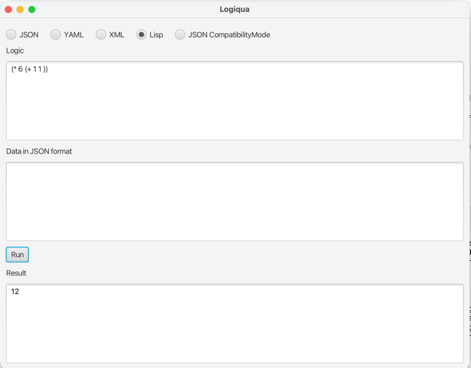

# Logiqua Interactive GUI Playground

The FX module provides an interactive graphical user interface (GUI) application built with JavaFX for testing and experimenting with Logiqua expressions. It allows you to quickly test expressions in any supported format without writing code.



## Overview

The `fx` module is a standalone JavaFX application that provides a simple, user-friendly interface for evaluating Logiqua expressions. It supports all Logiqua format parsers (JSON, YAML, XML, LISP-style, and infix expressions) and includes a JSON compatibility mode for testing JsonLogic expressions.

## Features

- **Multi-Format Support**: Test expressions in JSON, YAML, XML, LISP-style, or infix expression formats
- **JSON Compatibility Mode**: Test JsonLogic expressions directly
- **Interactive Evaluation**: Real-time expression evaluation with instant results
- **Context Data Input**: Provide variable data in JSON format for testing expressions with variables
- **Error Display**: Comprehensive error messages with full stack traces displayed in red
- **Simple Interface**: Clean, intuitive GUI with radio buttons for format selection
- **No Code Required**: Test expressions without writing any Java code

## Architecture

### Main Class

#### `Main`
The JavaFX application entry point:

```java
public class Main extends Application {
    public void start(Stage stage);
    public static void main(String[] args);
}
```

### Components

- **Main**: JavaFX application that creates and manages the GUI
- **ExceptionDumper**: Utility class for formatting exceptions with full stack traces, including suppressed exceptions and causes

### GUI Components

The application consists of:

1. **Format Selector**: Radio buttons for selecting the expression format:
   - JSON (default)
   - YAML
   - XML
   - Lisp
   - Expression (infix)
   - JSON Compatibility Mode

2. **Logic Text Area**: Multi-line text area for entering the Logiqua expression

3. **Data Text Area**: Multi-line text area for entering context data in JSON format (optional)

4. **Run Button**: Button to trigger expression evaluation

5. **Result Text Area**: Multi-line text area displaying:
   - Evaluation results (in black)
   - Error messages and stack traces (in red)

## Usage

### Running the Application

#### Using Maven

From the project root:

```bash
cd fx
mvn javafx:run
```

Or using the JavaFX Maven plugin directly:

```bash
cd fx
mvn clean javafx:run
```

#### Building and Running JAR

Build the application:

```bash
cd fx
mvn clean package
```

Run the JAR:

```bash
java -jar target/fx-1.0.1.jar
```

Or if JavaFX modules need to be specified:

```bash
java --module-path <path-to-javafx>/lib --add-modules javafx.controls,javafx.fxml -jar target/fx-1.0.1.jar
```

### Using the GUI

1. **Select Format**: Choose the format you want to use from the radio buttons at the top
   - Default is JSON format

2. **Enter Expression**: Type your Logiqua expression in the "Logic" text area
   - The syntax depends on the selected format
   - See the respective format module READMEs for syntax details

3. **Enter Data (Optional)**: If your expression uses variables, enter the data in JSON format in the "Data" text area
   - Example: `{"x": 10, "y": 20}`
   - Leave empty if no variables are needed

4. **Run**: Click the "Run" button to evaluate the expression

5. **View Results**: 
   - Successful evaluations show the result in black text
   - Errors show detailed error messages and stack traces in red text

## Examples

### JSON Format Example

**Format**: Select "JSON"

**Logic**:
```json
{
    "+": [
        {"var": "x"},
        {"var": "y"}
    ]
}
```

**Data**:
```json
{"x": 10, "y": 20}
```

**Result**: `30`

### YAML Format Example

**Format**: Select "YAML"

**Logic**:
```yaml
"+":
  - var: "x"
  - var: "y"
```

**Data**:
```json
{"x": 10, "y": 20}
```

**Result**: `30`

### LISP Format Example

**Format**: Select "Lisp"

**Logic**:
```lisp
(+ (var "x") (var "y"))
```

**Data**:
```json
{"x": 10, "y": 20}
```

**Result**: `30`

### Infix Expression Format Example

**Format**: Select "Expression"

**Logic**:
```
x + y
```

**Data**:
```json
{"x": 10, "y": 20}
```

**Result**: `30`

### XML Format Example

**Format**: Select "XML"

**Logic**:
```xml
<op symbol="+">
    <var id="x"/>
    <var id="y"/>
</op>
```

**Data**:
```json
{"x": 10, "y": 20}
```

**Result**: `30`

### Complex Expression Example

**Format**: Select "Expression"

**Logic**:
```
if(age > 18 and country == "US", "Eligible", "Not eligible")
```

**Data**:
```json
{"age": 25, "country": "US"}
```

**Result**: `"Eligible"`

### Array Operations Example

**Format**: Select "YAML"

**Logic**:
```yaml
filter:
  - - 1
    - 2
    - 3
    - 4
    - 5
  - "==":
    - "%":
      - var: ""
      - 2
    - 0
```

**Data**: (empty)

**Result**: `[2, 4]`

### Error Handling Example

**Format**: Select "JSON"

**Logic**:
```json
{
    "+": [
        {"var": "x"},
        {"var": "y"}
    ]
}
```

**Data**: (empty)

**Result**: Error message displayed in red showing that variables `x` and `y` are not found in the context.

## Supported Formats

The GUI supports all Logiqua format parsers:

- **JSON**: Standard JSON format (JsonLogic compatible)
- **YAML**: Human-readable YAML format with comments support
- **XML**: XML-based format for integration with XML-based systems
- **Lisp**: LISP-style prefix notation
- **Expression**: Infix expression format with operator precedence
- **JSON Compatibility Mode**: Direct JsonLogic API compatibility mode

All scripts compiled from any format can be converted to JSON using the `jsonify()` method for canonical storage and JSON-based searchability. See the [API Module README](../api/README.md) for details on the `jsonify()` method.

See the respective module READMEs for detailed syntax information:
- [JSON Module](../json/README.md)
- [YAML Module](../yaml/README.md)
- [XML Module](../xml/README.md)
- [LSP Module](../lsp/README.md)
- [Expression Module](../exp/README.md)
- [JsonLogic Module](../jsonlogic/README.md)

## Data Format

The data input field accepts JSON format only, regardless of which expression format is selected. This is because the data represents the context/variables that will be available to the expression, and JSON provides a universal format for this purpose.

### Valid Data Examples

```json
{"x": 10, "y": 20}
```

```json
{
    "name": "Logiqua",
    "version": 1.0,
    "active": true
}
```

```json
{
    "user": {
        "name": "John",
        "age": 30
    },
    "items": [1, 2, 3, 4, 5]
}
```

```json
{}
```

Empty data (no JSON) is also valid and results in an empty context.

## Error Handling

When an error occurs during evaluation, the application displays:

- **Error Type**: The exception class name
- **Error Message**: The exception message
- **Stack Trace**: Full stack trace showing where the error occurred
- **Suppressed Exceptions**: Any suppressed exceptions
- **Causes**: The full chain of causal exceptions

All error information is displayed in red text for easy identification.

### Common Errors

- **Syntax Errors**: Invalid expression syntax for the selected format
- **Missing Variables**: Variables referenced but not provided in data
- **Type Mismatches**: Operations on incompatible types
- **Invalid Data Format**: Malformed JSON in the data field
- **Empty Logic**: Expression field is empty

## Building

The module is built using Maven:

```bash
mvn clean install
```

To build an executable JAR:

```bash
mvn clean package
```

The JAR will be created in `target/fx-1.0.1.jar`.

## Testing

Run the tests with:

```bash
mvn test
```

## Dependencies

- **Java 21+**: Requires Java 21 or higher
- **JavaFX**: JavaFX modules (javafx-base, javafx-controls, javafx-fxml)
- **Logiqua Modules**: All Logiqua format modules and core modules:
  - `api` - Core API interfaces
  - `engine` - Execution engine
  - `commands` - Standard operations library
  - `json` - JSON format parser
  - `yaml` - YAML format parser
  - `xml` - XML format parser
  - `lsp` - LISP-style format parser
  - `exp` - Infix expression format parser
  - `jsonlogic` - JsonLogic compatibility layer
- **JUnit Jupiter**: For testing

## Requirements

- **Java 21+**: Java 21 or higher required
- **JavaFX**: JavaFX runtime must be available
  - On Java 11-16: JavaFX needs to be installed separately
  - On Java 17+: JavaFX may need to be added as a module path
  - The Maven JavaFX plugin handles this automatically when using `mvn javafx:run`

## Troubleshooting

### JavaFX Not Found

If you get errors about JavaFX modules not being found:

1. **Using Maven**: Use `mvn javafx:run` which handles JavaFX automatically
2. **Running JAR**: Ensure JavaFX is on the module path:
   ```bash
   java --module-path <javafx-path>/lib --add-modules javafx.controls,javafx.fxml -jar target/fx-1.0.1.jar
   ```

### Application Won't Start

- Ensure Java 21+ is installed
- Check that all dependencies are available
- Verify JavaFX is properly configured

### Expression Evaluation Errors

- Check the expression syntax matches the selected format
- Verify data JSON is valid (use `{}` for empty data)
- Ensure all referenced variables are provided in the data field
- Check the error message for specific details

## License

See the main project LICENSE file for license information.

## See Also

- [Main Project README](../README.md) - Overall project documentation
- [API Module README](../api/README.md) - Core API documentation
- [Engine Module README](../engine/README.md) - Execution engine documentation
- [Commands Module README](../commands/README.md) - Standard operations documentation
- [JSON Module README](../json/README.md) - JSON format documentation
- [YAML Module README](../yaml/README.md) - YAML format documentation
- [XML Module README](../xml/README.md) - XML format documentation
- [LSP Module README](../lsp/README.md) - LISP-style format documentation
- [Expression Module README](../exp/README.md) - Infix expression format documentation
- [JsonLogic Module README](../jsonlogic/README.md) - JsonLogic compatibility documentation
